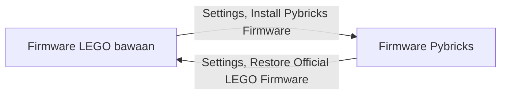
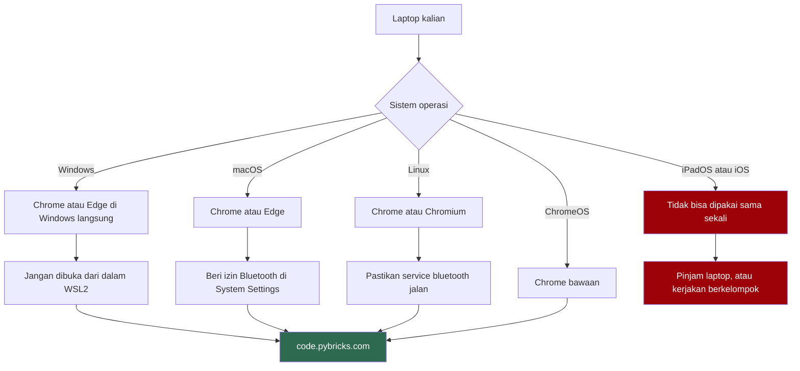
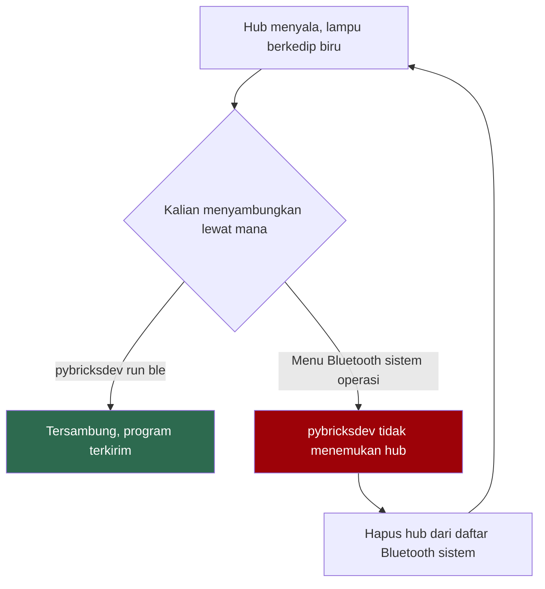

# Panduan Instalasi Pybricks untuk LEGO MINDSTORMS

Panduan ini untuk memasang Pybricks pada hub LEGO MINDSTORMS Robot Inventor (set 51515), supaya kalian bisa memprogramnya dengan Python.

Pybricks berdiri sendiri. Tidak ada hubungannya dengan ROS 2 dan Gazebo yang kalian pasang di panduan lain, dan tidak perlu menunggu keduanya selesai. Kerjakan panduan ini kapan saja.

## Apa yang sebenarnya kita pasang

Hub MINDSTORMS itu komputer kecil. Di dalamnya ada firmware, sama seperti laptop punya sistem operasi. Firmware bawaan LEGO hanya mau bekerja dengan aplikasi LEGO.

Pybricks mengganti firmware itu dengan MicroPython. Setelah diganti, hub menjalankan program Python langsung di dalam hub, dan semua motor serta sensor jadi bisa dipakai dari kode.

Setelah firmware terpasang, kalian menulis kode di VS Code seperti proyek Python biasa. Program dikirim ke hub lewat Bluetooth memakai `pybricksdev`, alat baris perintah dari tim Pybricks. Situs `code.pybricks.com` cuma dipakai untuk memasang dan mengembalikan firmware, bukan untuk menulis kode.


Proses ganti firmware bisa dibalik kapan saja. Bagian 5 berisi caranya. Kalau kalian ragu sebelum mulai, jalankan dulu prosedur pemulihan itu untuk melihat bahwa jalurnya memang ada.



Hub cuma bisa berada di salah satu keadaan, tidak pernah keduanya sekaligus.

## Bagian 1: Yang perlu disiapkan

Hub yang kita pakai bentuknya seperti ini, dengan huruf port A sampai F tercetak di badannya:


| Barang | Keterangan |
|---|---|
| Hub Robot Inventor | Kotak persegi dengan layar 5x5, ada di set 51515 |
| Kabel microUSB | Wajib untuk memasang firmware pertama kali. Kabel data, bukan kabel yang cuma bisa mengisi daya |
| Laptop dengan Bluetooth | Windows 10 atau 11, macOS, atau Linux |
| Browser | Chrome, Edge, atau Chromium. Hanya untuk memasang firmware |
| VS Code | Editor untuk menulis program. Sudah terpasang kalau kalian mengikuti panduan ROS 2 |
| Koneksi internet | Sekali saja, untuk memasang `pybricksdev` di bagian 3.2. Setelah itu mengirim program tidak butuh internet |

ChromeOS cukup untuk memasang firmware lewat browser, tapi tidak bisa menjalankan `pybricksdev`, karena lingkungan Linux di ChromeOS tidak mendapat akses Bluetooth. Pengguna ChromeOS kerjakan bagian 3 dengan laptop teman sekelompok.

### 1.1 Browser yang bisa dan tidak bisa

Browser hanya dibutuhkan untuk bagian 2 dan bagian 5, yaitu memasang dan mengembalikan firmware. Pemasangan itu berjalan di atas WebUSB dan Web Bluetooth. Tidak semua browser punya ini, dan yang tidak punya bukan karena belum sempat, melainkan karena vendornya memutuskan tidak akan membuatnya.

| Browser | Windows | macOS | Linux | ChromeOS | iPadOS dan iOS |
|---|---|---|---|---|---|
| Chrome | bisa | bisa | bisa | bisa | tidak |
| Edge | bisa | bisa | bisa | bisa | tidak |
| Chromium | bisa | bisa | bisa | bisa | tidak |
| Safari | tidak ada | tidak ada | tidak ada | tidak ada | tidak ada |
| Firefox | tidak ada | tidak ada | tidak ada | tidak ada | tidak ada |

Dokumentasi Pybricks menyebutkan dua hal ini secara eksplisit. Firefox tidak mendukung Bluetooth di platform mana pun. iPad dan iPhone tidak didukung karena Safari di iOS dan Chrome di iOS sama-sama tidak punya akses Bluetooth.

Kalau selama ini kalian memakai Safari atau Firefox, pasang Chrome khusus untuk mata kuliah ini. Tidak ada cara lain, dan tidak akan ada.

Jalur kalian, tergantung sistem operasi:



### 1.2 Pengguna Windows, jangan lewat WSL2

Di panduan ROS 2, kalian bekerja di dalam WSL2. Untuk Pybricks, jangan.

WSL2 tidak punya akses ke Bluetooth. Ini bukan soal driver yang belum dipasang. Maintainer `usbipd-win` menyatakan sendiri bahwa WSL berjalan seperti container dan layanan Bluetooth-nya memang tidak ada di sana. Orang yang berhasil menembusnya harus mengompilasi kernel WSL2 sendiri, dan itu di luar lingkup kelas ini.

Buka `code.pybricks.com` di Chrome atau Edge yang berjalan di Windows langsung. Hal yang sama berlaku untuk `pybricksdev` di bagian 3. Pasang dan jalankan dari PowerShell Windows, termasuk terminal VS Code yang dibuka di Windows, bukan dari terminal Ubuntu atau jendela VS Code yang tersambung ke WSL. Biarkan WSL2 untuk ROS 2.

Cara cepat mengeceknya: di pojok kiri bawah VS Code, jendela yang tersambung ke WSL menampilkan tulisan `WSL: Ubuntu`. Untuk Pybricks, buka jendela VS Code baru yang tidak menampilkan tulisan itu.

### 1.3 Pengguna macOS

Chrome perlu izin Bluetooth dari sistem. Buka System Settings, masuk ke Privacy & Security, lalu Bluetooth, dan pastikan Chrome ada di daftar dan aktif.

Kalau izin ini pernah ditolak, Chrome tidak menampilkan pesan error yang jelas. Yang terlihat cuma daftar perangkat yang kosong terus. Periksa ini sebelum menyalahkan hub.

Izin yang sama dibutuhkan oleh aplikasi tempat kalian menjalankan `pybricksdev`, yaitu Terminal, iTerm, atau VS Code. macOS biasanya menanyakannya saat `pybricksdev` pertama kali mencari hub. Kalau kalian terlanjur menolak, aktifkan aplikasinya di daftar yang sama.

### 1.4 Pengguna Linux

Chrome atau Chromium sudah cukup. Pastikan BlueZ terpasang dan service-nya jalan:

```bash
bluetoothctl --version
systemctl status bluetooth
```

Kalau `navigator.bluetooth` tidak dikenali di browser kalian, aktifkan flag `#experimental-web-platform-features` lewat `about://flags`, lalu restart browser.

## Bagian 2: Pasang firmware Pybricks

Semua gambar di bagian ini diambil langsung dari `code.pybricks.com`. Kotak merah bernomor menandai yang harus diklik, urut dari nomor 1.

### 2.1 Buka aplikasinya

Buka `https://code.pybricks.com` di Chrome atau Edge.

Halaman ini sebenarnya punya editor kode sendiri, tapi di kelas ini kita tidak memakainya. Yang kita pakai dari halaman ini cuma pemasang firmware. Kode ditulis di VS Code, di bagian 3.

Saat pertama kali dibuka, muncul kotak Welcome to Pybricks Code. Itu tur singkat. Klik tanda silang di pojoknya untuk menutup, atau ikuti turnya kalau mau.

### 2.2 Buka panel Settings

Tidak ada menu Tools di Pybricks Code. Semua urusan firmware ada di panel Settings, yaitu tombol bergambar roda gigi di kiri atas.


Panel terbuka di sisi kiri. Di bagian Firmware, klik Install Pybricks Firmware.


### 2.3 Ikuti empat langkah pemasangan

Jendela pemasangan punya empat langkah. Daftar langkahnya terlihat di kolom kiri jendela.

**Langkah 1, Select hub type.** Gambar hub di sini tidak diberi nama. Hub Robot Inventor adalah yang putih dengan bagian bawah hijau toska, di baris kedua. Klik lingkaran di sebelah kirinya, lalu klik Next.


Hati-hati dengan hub kuning di baris pertama. Itu SPIKE Prime, bentuknya mirip tapi firmwarenya berbeda.

**Langkah 2, Accept licenses.** Centang kotak I have read and agree to the license terms and conditions. Tombol Next baru bisa diklik setelah kotak ini dicentang.


**Langkah 3, Configure options.** Ganti isi kolom Hub name dengan nama hub kalian, lalu klik Next. Di contoh ini namanya Kancil.


Tulisan optional di sini menjebak. Kalau dibiarkan, semua hub akan bernama Pybricks Hub. Saat banyak orang mencari hub-nya masing-masing di daftar Bluetooth yang isinya nama identik semua, tidak ada yang tahu mana hub miliknya.

Nama yang dipakai angkatan sebelumnya berupa nama hewan dan nama kota. Apa saja boleh asal berbeda. Tempelkan label fisik dengan nama yang sama di hub itu.

**Langkah 4, Install.** Layar ini berisi video dan delapan instruksi. Kerjakan urut, dan jangan klik Install sebelum lampu hub berkedip dengan pola yang benar.


1. Cabut kabel USB dari hub.
2. Pastikan hub mati.
3. Tekan dan tahan tombol Bluetooth di hub.
4. Sambil tetap menahan tombol, colokkan kabel microUSB.
5. Tunggu sampai lampu Bluetooth berkedip bergantian merah muda, hijau, biru, lalu mati.
6. Lepaskan tombol Bluetooth.
7. Klik tombol Install di pojok kanan bawah jendela.
8. Chrome membuka popup daftar perangkat. Pilih LEGO Technic Large Hub in DFU Mode, lalu klik Connect.

Setelah itu progress bar berjalan. Jangan cabut kabel sampai selesai.

Popup di langkah 8 adalah jendela milik Chrome, bukan milik Pybricks, jadi tidak ada gambarnya di sini. Bentuknya kotak kecil di bawah address bar berisi daftar perangkat dan tombol Connect.

Nama LEGO Technic Large Hub memang terdengar salah, tapi itu nama resmi hub Robot Inventor saat berada di update mode. Pilih yang itu.

Kalau popup terbuka tapi daftarnya kosong, baca kotak kuning di bawah instruksi. Di Windows, komputer yang baru pertama kali dipakai untuk Pybricks biasanya perlu driver USB dulu. Klik tautan Click for instructions di kotak itu dan ikuti panduannya.

## Bagian 3: Tulis kode di VS Code, kirim lewat Bluetooth

Mulai dari sini, `code.pybricks.com` boleh ditutup. Kode ditulis di VS Code, lalu dikirim ke hub oleh `pybricksdev` dari terminal.

Tutup juga tab `code.pybricks.com` kalau masih tersambung ke hub. Hub cuma menerima satu sambungan Bluetooth pada satu waktu. Selama tab itu memegang hub, `pybricksdev` tidak akan menemukannya.

### 3.1 Siapkan folder proyek

Buat satu folder untuk robot kalian, lalu buka folder itu di VS Code lewat File, Open Folder. Pengguna Windows, pastikan pojok kiri bawah VS Code tidak menampilkan `WSL: Ubuntu`, lihat bagian 1.2.

Buka terminal di dalam VS Code lewat menu Terminal, New Terminal. Semua perintah di bagian 3 dijalankan di terminal ini, di folder proyek.

### 3.2 Pasang pybricksdev dan pybricks

Ada dua paket Python yang dibutuhkan, dan keduanya dipasang di laptop, bukan di hub:

| Paket | Gunanya |
|---|---|
| `pybricksdev` | Mengompilasi program dan mengirimnya ke hub lewat Bluetooth |
| `pybricks` | Daftar fungsi Pybricks untuk VS Code, supaya kode dilengkapi otomatis dan penjelasan fungsi muncul saat kursor diarahkan ke namanya. Paket ini bukan firmware dan tidak dikirim ke hub |

Keduanya butuh Python 3.10 atau lebih baru, dan keduanya hanya tersedia di PyPI. Di conda-forge tidak ada, jadi pengguna pixi dan conda tetap memasangnya dari PyPI.

Hasil akhir setiap jalur sama: satu environment Python milik proyek ini yang berisi kedua paket. Jalur di bawah diurutkan sesuai prioritas dukungan di kelas ini: pip, conda, uv, lalu pixi. Kalau belum punya pilihan, pakai pip.

Pilih satu saja dari jalur di bawah.

#### Jalur A: pip dan venv

Butuh Python 3.10 atau lebih baru yang sudah terpasang. Periksa dengan `python --version`. Di macOS dan Linux, perintahnya biasanya `python3`.

Kalau belum ada atau versinya terlalu lama, pasang dari python.org. Pengguna Windows, centang Add python.exe to PATH di layar pertama installer. Pengguna Linux, pasang lewat package manager distro, misalnya `sudo apt install python3 python3-venv` di Ubuntu.

Buat environment, lalu aktifkan. Di Windows:

```powershell
python -m venv .venv
.venv\Scripts\Activate.ps1
```

Di macOS dan Linux:

```bash
python3 -m venv .venv
source .venv/bin/activate
```

Setelah aktif, awal baris terminal diberi tulisan `(.venv)`. Baru pasang paketnya:

```bash
pip install pybricksdev pybricks
```

Jangan jalankan `pip install` sebelum environment aktif. Tanpa environment, paketnya masuk ke Python sistem, dan di sebagian Linux dan macOS perintah itu ditolak dengan pesan `externally-managed-environment`.

#### Jalur B: conda, mamba, atau micromamba

Buat environment bernama `pybricks`, aktifkan, lalu pasang dari PyPI dengan pip di dalamnya:

```bash
conda create -n pybricks -c conda-forge python=3.12 pip
conda activate pybricks
pip install pybricksdev pybricks
```

Pengguna mamba atau micromamba, ganti `conda` dengan `mamba` atau `micromamba`. Setiap kali membuka terminal baru di luar VS Code, jalankan `conda activate pybricks` dulu.

#### Jalur C: uv

Pasang uv dulu kalau belum ada. Pengguna Windows, di PowerShell:

```powershell
powershell -ExecutionPolicy ByPass -c "irm https://astral.sh/uv/install.ps1 | iex"
```

Pengguna macOS dan Linux:

```bash
curl -LsSf https://astral.sh/uv/install.sh | sh
```

Tutup lalu buka lagi terminal VS Code, kemudian di folder proyek:

```bash
uv venv
uv pip install pybricksdev pybricks
```

Environment-nya ada di folder `.venv`.

#### Jalur D: pixi

Di folder proyek:

```bash
pixi init
pixi add "python>=3.10"
pixi add --pypi pybricksdev pybricks
```

Environment-nya ada di folder `.pixi/envs/default`. Pengguna pixi menjalankan semua perintah `pybricksdev` di panduan ini dengan awalan `pixi run`, misalnya `pixi run pybricksdev --version`. Cara lainnya, jalankan `pixi shell` sekali, lalu ketik perintahnya tanpa awalan.

`pixi global install` tidak bisa dipakai di sini, karena perintah itu hanya memasang paket dari conda-forge.

#### Pilih interpreter di VS Code

Supaya VS Code memakai environment tadi, tekan `Ctrl` + `Shift` + `P` (di macOS `Cmd` + `Shift` + `P`), ketik Python: Select Interpreter, lalu pilih yang sesuai jalur kalian:

| Jalur | Pilih interpreter ini |
|---|---|
| pip, uv | Yang ada tulisan `.venv` |
| conda, mamba | Yang bernama `pybricks` |
| pixi | Yang ada tulisan `.pixi`. Kalau tidak muncul, pilih Enter interpreter path, lalu isi `.pixi/envs/default/python.exe` di Windows atau `.pixi/envs/default/bin/python` di macOS dan Linux |

Setelah interpreter dipilih, tutup terminal VS Code lalu buka terminal baru. Terminal baru ini otomatis memakai environment tadi, dan garis kuning di bawah setiap `from pybricks...` hilang.

#### Periksa hasilnya

Di terminal VS Code yang baru dibuka:

```bash
pybricksdev --version
```

Kalau keluar nomor versi, misalnya `pybricksdev v2.3.2`, pemasangan berhasil. Pengguna pixi, pakai `pixi run pybricksdev --version`.

Sudah memasang `pybricksdev` secara global lewat `uv tool install` atau `pipx install`? Itu juga jalan. Yang penting perintah `pybricksdev --version` di atas berhasil. Paket `pybricks` tetap dipasang di environment proyek untuk VS Code, dan perintah di `tasks.json` bagian 3.5 perlu diganti, lihat catatan di sana.

### 3.3 Program pertama

Buat file `main.py` di folder proyek, isi dengan ini:

```python
from pybricks.hubs import InventorHub
from pybricks.tools import wait

hub = InventorHub()

print("hub siap")
hub.speaker.beep()
wait(1000)
print("baterai:", hub.battery.voltage(), "mV")
```

Cabut kabel USB dari hub. Nyalakan hub dengan menekan tombol tengah. Lampu di sekeliling tombol itu akan berkedip biru, artinya hub siap disambungkan.


Di terminal VS Code, jalankan perintah ini. Ganti `Kancil` dengan nama yang kalian beri di bagian 2.3. Pengguna pixi, tambahkan `pixi run` di depannya:

```bash
pybricksdev run ble --name Kancil main.py
```

Yang terjadi berurutan:

1. Terminal menampilkan `Searching for Kancil...` selama beberapa detik.
2. Program dikompilasi di laptop, lalu dikirim ke hub. Terminal menampilkan progress bar pengiriman.
3. Hub berbunyi, dan terminal menampilkan `hub siap` lalu angka baterai, misalnya `baterai: 8120 mV`.
4. Setelah program selesai, `pybricksdev` memutus sambungan dan terminal kembali siap menerima perintah.

Kalau hub berbunyi dan angka baterai muncul di terminal, instalasi kalian berhasil.

Semua `print()` di program kalian muncul di terminal ini, begitu juga pesan error Python dari hub. Untuk menghentikan program yang sedang berjalan, tekan tombol tengah hub.

Kalau tidak ada hub bernama `Kancil` yang ditemukan dalam sekitar 10 detik, perintah berhenti dengan `TimeoutError`. Lihat tabel masalah di bawah.

Jangan menyambungkan hub lewat menu Bluetooth di sistem operasi. Ini instruksi resmi dari Pybricks dan sering dilanggar karena terasa masuk akal. `pybricksdev` mencari dan menyambungkan hub sendiri.



### 3.4 Tetap tersambung selama bereksperimen

Setiap kali `pybricksdev run` dijalankan, laptop mencari hub dari awal, dan itu makan beberapa detik. Saat kalian mengubah kode berkali-kali, pakai `--stay-connected`:

```bash
pybricksdev run ble --name Kancil --stay-connected main.py
```

Setelah program selesai, sambungan tidak diputus. Terminal menampilkan menu:

| Pilihan | Artinya |
|---|---|
| Recompile and Run | Kirim ulang `main.py` yang sudah kalian simpan, lalu jalankan |
| Recompile and Download | Kirim ulang tanpa langsung menjalankan |
| Run Stored Program | Jalankan program yang sudah ada di hub |
| Change Target File | Ganti file yang dikirim |
| Exit | Putus sambungan dan keluar |

Pilih dengan tombol panah, lalu `Enter`. Simpan file di VS Code dengan `Ctrl` + `S` sebelum memilih Recompile and Run. Yang dikirim adalah isi file di disk, bukan yang sedang terlihat di editor.

### 3.5 Kirim dengan satu tombol

Supaya tidak mengetik perintah yang sama terus, buat file `.vscode/tasks.json` di folder proyek:

```json
{
  "version": "2.0.0",
  "tasks": [
    {
      "label": "Pybricks: kirim dan jalankan",
      "type": "process",
      "command": "${command:python.interpreterPath}",
      "args": ["-m", "pybricksdev", "run", "ble", "--name", "Kancil", "${file}"],
      "group": { "kind": "build", "isDefault": true },
      "problemMatcher": []
    }
  ]
}
```

Ganti `Kancil` dengan nama hub kalian. Task ini menjalankan `pybricksdev` dari interpreter yang kalian pilih di bagian 3.2, jadi sama untuk pip, conda, uv, maupun pixi.

Kalau `pybricksdev` kalian pasang secara global lewat `uv tool` atau `pipx`, ganti isi `"command"` menjadi `"pybricksdev"` dan hapus `"-m", "pybricksdev",` dari `"args"`.

Setelah itu, buka file program yang mau dikirim, lalu tekan `Ctrl` + `Shift` + `B` (di macOS `Cmd` + `Shift` + `B`). VS Code menyimpan file, mengirimnya ke hub, dan menampilkan hasilnya di panel terminal.

Yang dikirim adalah file yang sedang terbuka di editor. Kalau yang terbuka file pembantu, bukan program utama, bukalah program utamanya dulu.

### 3.6 Program yang terdiri dari beberapa file

Program boleh dipecah menjadi beberapa file di folder yang sama. Misalnya fungsi pembantu ditaruh di `gerak.py`, lalu di `main.py` ditulis `from gerak import maju`. `pybricksdev` ikut mengirim file yang diimpor itu ke hub.

Kirim file utamanya, `main.py`, bukan file pembantunya.

### 3.7 Program tersimpan di dalam hub

Program yang sudah dikirim tetap tersimpan di hub setelah sambungan diputus. Tutup laptop, lalu tekan tombol tengah hub. Program berjalan lagi tanpa komputer.

Hub Robot Inventor punya lima program slot. Tombol kiri dan kanan memilih slot, angka slot muncul di layar 5x5. `pybricksdev` tidak punya pilihan slot. Program masuk ke slot yang sedang terpilih di hub, jadi pilih slotnya dengan tombol hub sebelum mengirim.

Ini yang membedakan hub dari mikrokontroler yang harus selalu terhubung ke komputer. Robot kalian benar-benar berdiri sendiri.

## Bagian 4: Pakai tanpa internet

Setelah `pybricksdev` terpasang, mengirim program ke hub tidak butuh internet sama sekali. Yang dipakai cuma Bluetooth antara laptop dan hub.

Internet hanya dibutuhkan untuk dua hal. Pertama, memasang `pybricksdev` dan `pybricks` di bagian 3.2. Kedua, membuka `code.pybricks.com` untuk memasang atau mengembalikan firmware. Kerjakan keduanya dari koneksi yang lancar sebelum praktikum.

## Bagian 5: Mengembalikan firmware LEGO

Kalau kalian perlu memakai aplikasi LEGO lagi, firmware asli bisa dikembalikan.

Buka panel Settings lewat tombol roda gigi, klik Restore Official LEGO Firmware, pilih hub hijau toska, lalu klik Next dan ikuti instruksi di layar. Cara masuk ke update mode sama seperti langkah 4 di bagian 2.3.


Selama Pybricks terpasang, aplikasi LEGO tidak akan mengenali hub. Keduanya tidak bisa dipakai bergantian tanpa flash ulang.

## Instalasi dianggap selesai kalau

1. Firmware Pybricks terpasang di hub dengan nama yang kalian beri sendiri.
2. `pybricksdev --version` menampilkan nomor versi di terminal. Pengguna Windows, di PowerShell Windows, bukan di WSL2.
3. `pybricksdev run ble --name <nama hub> main.py` menjalankan program di bagian 3.3, hub berbunyi, dan angka voltase muncul di terminal.
4. `Ctrl` + `Shift` + `B` di VS Code melakukan hal yang sama.
5. Program yang sama jalan lagi saat kalian tekan tombol tengah hub dalam keadaan tidak tersambung ke laptop.

## Masalah yang sering muncul

| Yang terlihat | Penyebab | Solusi |
|---|---|---|
| Saat memasang firmware, tidak ada popup perangkat sama sekali | Browsernya Safari atau Firefox | Pasang Chrome, Edge, atau Chromium. Tidak ada solusi lain |
| Popup terbuka tapi daftarnya kosong terus di macOS | Chrome belum diberi izin Bluetooth oleh sistem | System Settings, Privacy & Security, Bluetooth, aktifkan Chrome |
| Sudah `usbipd attach` tapi `hci0` tidak muncul, `bluetoothctl` menggantung | Mencoba menjalankan Pybricks dari dalam WSL2 | Jalankan browser dan `pybricksdev` di Windows langsung. WSL2 tidak punya Bluetooth |
| `pybricksdev` tidak dikenal sebagai perintah | Environment proyek belum aktif di terminal itu | Pilih interpreter di bagian 3.2, lalu buka terminal VS Code yang baru. Pengguna pixi, pakai `pixi run pybricksdev`. Pengguna conda di luar VS Code, jalankan `conda activate pybricks` dulu |
| Di Windows, muncul `Activate.ps1 cannot be loaded because running scripts is disabled on this system` | PowerShell memblokir skrip aktivasi environment | Jalankan `Set-ExecutionPolicy -Scope CurrentUser RemoteSigned` sekali, lalu buka terminal baru |
| `pip install` ditolak dengan `externally-managed-environment` | pip dijalankan di Python sistem, bukan di environment | Aktifkan `.venv` dulu, lihat jalur A di bagian 3.2 |
| `Searching for Kancil...` lalu `TimeoutError` | Hub mati, nama salah ketik, hub masih tersambung ke tab `code.pybricks.com` atau laptop lain, atau perintah dijalankan dari WSL2 | Nyalakan hub sampai lampunya berkedip biru, cek ejaan nama termasuk huruf besar dan kecil, tutup tab `code.pybricks.com`, jalankan dari PowerShell Windows |
| Lupa nama hub | Nama diberi saat memasang firmware | Nyalakan hanya hub kalian di dekat laptop, lalu kirim program berisi `print(InventorHub().system.info()["name"])` tanpa `--name`. Tanpa `--name`, `pybricksdev` menyambung ke hub Pybricks pertama yang ditemukan, jadi jangan lakukan ini saat banyak hub lain menyala di sekitar |
| Di macOS, `pybricksdev` tidak pernah menemukan hub | Terminal atau VS Code belum diberi izin Bluetooth | System Settings, Privacy & Security, Bluetooth, aktifkan Terminal atau VS Code |
| Error panjang yang berakhir dengan `CalledProcessError` dan `mpy-cross` | Ada kesalahan tulis Python, misalnya kurung atau titik dua yang kurang. Program gagal dikompilasi sebelum dikirim | Cari baris yang diberi garis merah oleh VS Code. Pesan error ini tidak menyebut nomor barisnya |
| Hub tidak ditemukan padahal lampunya berkedip biru | Hub sudah terpasang di menu Bluetooth sistem operasi | Hapus hub dari daftar Bluetooth sistem, lalu jalankan `pybricksdev` lagi |
| Semua `from pybricks...` diberi garis kuning di VS Code | Paket `pybricks` belum dipasang, atau VS Code memakai interpreter yang salah | Pasang `pybricks` di environment proyek, lalu pilih interpreternya, lihat bagian 3.2 |
| Sambungan putus di tengah jalan, atau gagal saat transfer program | Interferensi dari perangkat Bluetooth lain | Matikan keyboard dan mouse Bluetooth yang tidak dipakai. Ini disebut langsung di dokumentasi Pybricks |
| Di Windows, hub kadang terdeteksi kadang tidak | Adapter Bluetooth bawaan laptop bermasalah | Pakai USB Bluetooth dongle. Yang paling stabil adalah dongle berbasis chip CSR 4.0 yang memakai driver Microsoft generik |
| `code.pybricks.com` terasa error setelah update | Cache browser | Tekan `Ctrl` + `F5` untuk memuat ulang halaman |
| Firmware gagal terpasang, proses berhenti di tengah | Kabel microUSB yang dipakai kabel charge saja | Ganti dengan kabel data. Kabel yang tidak punya jalur data tetap menyalakan lampu hub, jadi kelihatan normal |
| Hub tidak menyala sama sekali | Baterai habis | Isi lewat microUSB, tunggu beberapa menit sebelum mencoba lagi |
| Program berjalan tapi motor diam | Motor tercolok di port yang berbeda dari yang ditulis di kode | Cek huruf port di badan hub, sesuaikan `Port.A` sampai `Port.F` di kode |

Kalau masalah kalian tidak ada di tabel ini, catat pesan error persis seperti yang muncul, sistem operasi, browser, dan versi `pybricksdev` yang dipakai, serta nama hub dan slot yang sedang terpilih. Sertakan catatan itu saat bertanya.

## Sebelum praktikum pertama

Baterai hub terpasang di dalam dan diisi lewat microUSB. Isi penuh malam sebelumnya. Hub dengan baterai lemah bisa tersambung tapi motornya bergerak lebih lambat dari yang kalian perintahkan, dan gejalanya mudah disalahartikan sebagai kode yang salah.

Pasang `pybricksdev` dan `pybricks` di rumah, dari internet yang lancar, lalu coba kirim program di bagian 3.3 sekali. Masalah environment Python dan izin Bluetooth jauh lebih cepat diselesaikan sebelum praktikum daripada saat praktikum berlangsung.

Bawa kabel microUSB. Satu kabel per kelompok sudah cukup, tapi tanpa kabel sama sekali kalian tidak bisa memasang firmware.

Materi lanjutannya ada di `dasar-pybricks.md`, lalu `pengikut-garis.md`.
